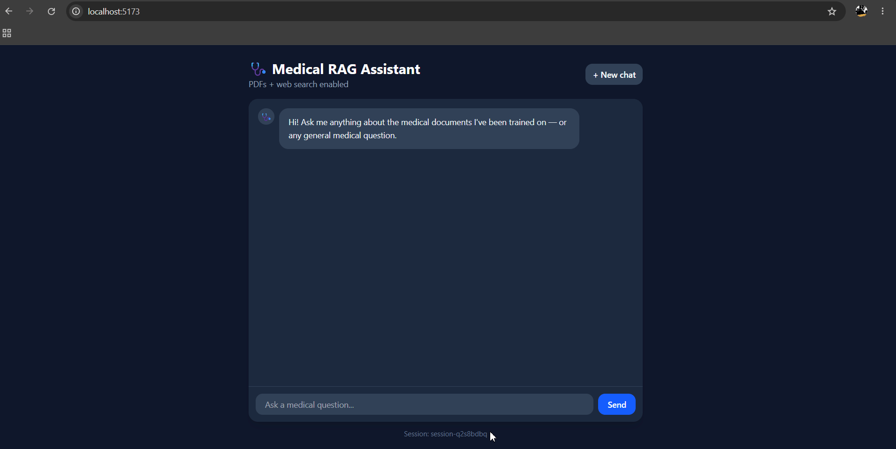
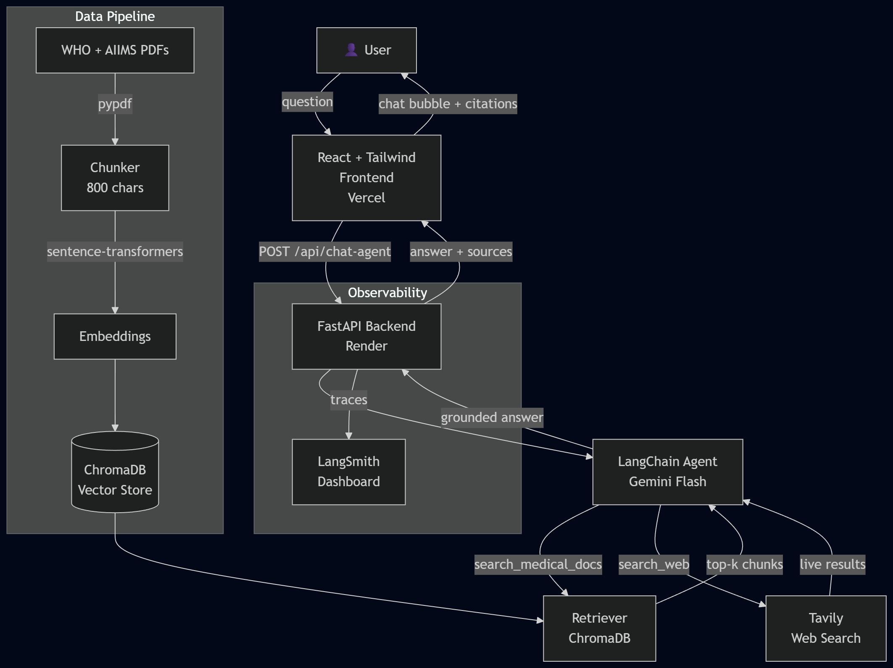

# 🩺 Medical RAG Chatbot

A production-grade Retrieval-Augmented Generation (RAG) chatbot for medical information, built with LangChain, Gemini, ChromaDB, FastAPI, and React.

**Live Demo → [medical-rag-chatbot-seven.vercel.app](https://medical-rag-chatbot-seven.vercel.app)**  
**API Docs → [medical-rag-chatbot-api.onrender.com/docs](https://medical-rag-chatbot-api.onrender.com/docs)**

---



---

## What it does

- Answers medical questions grounded in **WHO and AIIMS clinical guideline PDFs**
- Falls back to **live web search** (Tavily) when the answer isn't in the documents
- Maintains **per-user conversation memory** across multi-turn dialogues
- Shows **source citations** (filename + page number) for every answer
- Persists chat history in the browser across page refreshes

---

## Architecture



### How a question gets answered

1. User sends a question from the React frontend
2. FastAPI routes it to a **LangChain Agent** powered by Gemini Flash
3. The agent first calls `search_medical_docs` — a semantic search over ChromaDB using `sentence-transformers/all-MiniLM-L6-v2` embeddings
4. If the PDFs don't contain a sufficient answer, the agent calls `search_web` via Tavily for real-time information
5. Gemini synthesizes the retrieved context into a grounded answer with source citations
6. Every chain/agent run is traced in **LangSmith** for observability

### Offline ingestion pipeline

```
WHO + AIIMS PDFs → pypdf → RecursiveCharacterTextSplitter (800 chars, 150 overlap)
→ HuggingFace Embeddings → ChromaDB (persisted to disk)
```

---

## Tech Stack

| Layer | Technology |
|---|---|
| LLM | Gemini Flash (via LangChain) |
| Orchestration | LangChain Agent + ConversationalRetrievalChain |
| Vector Store | ChromaDB |
| Embeddings | sentence-transformers/all-MiniLM-L6-v2 (local) |
| Web Search | Tavily API |
| Backend | FastAPI + Uvicorn |
| Frontend | React + Tailwind CSS + Vite |
| Containerization | Docker + docker-compose |
| Observability | LangSmith |
| Deployment | Render (backend) + Vercel (frontend) |

---

## Evaluation (LLM-as-Judge)

Evaluated on 25 domain-specific questions using a custom LLM-as-judge framework implementing RAGAS-style metrics:

| Metric | Score |
|---|---|
| Faithfulness | 0.84 |
| Answer Relevancy | 0.70 |
| Context Precision | 0.38 |
| Context Recall | 0.65 |

Context precision (0.38) reflects that `TOP_K=4` retrieves more chunks than strictly needed for simple factual questions — a known trade-off between recall and precision in dense retrieval.

---

## Running Locally

### Prerequisites
- Python 3.11+
- Node.js 20+
- Docker Desktop (optional)

### Backend

```bash
# Clone and set up
git clone https://github.com/AbishekBino/medical-rag-chatbot.git
cd medical-rag-chatbot

python -m venv venv
venv\Scripts\activate  # Windows
pip install -r requirements.txt

# Add your API keys
cp .env.example .env
# Edit .env with your GEMINI_API_KEY, LANGCHAIN_API_KEY, TAVILY_API_KEY

# Run ingestion (builds ChromaDB from PDFs)
python ingest.py

# Start backend
uvicorn app.api.main:app --reload --port 8000
```

### Frontend

```bash
cd ui
npm install
npm run dev
```

Open `http://localhost:5173`

### Docker (runs everything with one command)

```bash
docker compose up --build
```

---

## Project Structure

```
rag-chatbot/
├── app/
│   ├── api/          # FastAPI routes, schemas
│   ├── core/         # RAG chain, ingestion, retriever, agent
│   └── memory/       # Per-session conversation memory
├── data/
│   ├── pdfs/         # Source medical PDFs
│   └── chroma_db/    # Persisted vector store
├── eval/             # Evaluation scripts + results
├── ui/               # React + Tailwind frontend
├── notebooks/        # Exploration notebooks
├── Dockerfile
├── docker-compose.yml
└── ingest.py
```

---

## Key Design Decisions

**Why ChromaDB over Pinecone/Weaviate?**
ChromaDB runs locally without an API key, persists to disk, and is fast enough for small-to-medium corpora. For scale beyond ~1M chunks, a managed vector DB would make more sense.

**Why agent instead of always-RAG?**
A straight retrieval chain can only answer from static documents. The agent pattern lets Gemini decide whether the question needs document retrieval, live web search, or its own training knowledge — making it genuinely more useful for a medical assistant use case where both clinical guidelines and current events matter.

**Why `TEMPERATURE=0.2`?**
Medical information requires factual consistency over creativity. Low temperature reduces the risk of the LLM elaborating beyond what the retrieved context supports.

**Chunking strategy**
800-character chunks with 150-character overlap were chosen to keep chunks semantically coherent (a full clinical recommendation typically fits in 600-900 chars) while ensuring context continuity across chunk boundaries.

---

## Author

**Abishek Bino** — B.Tech CSE (AI/ML), LMCST, KTU 2026  
[GitHub](https://github.com/AbishekBino) · [LinkedIn](#)

---

> ⚠️ This chatbot is for informational purposes only and does not constitute medical advice. Always consult a qualified healthcare professional for medical decisions.